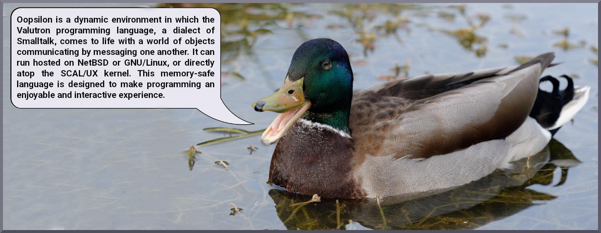

"Object-Oriented Programming System Intended for Local or Networked use"

### Overview

### Source Tree
 - `libstkern` -  the Smalltalk kernel class library; defines Object, Method,
 BlockClosure, and so on.
 - `psc` - Platform-Specific Code - the interface between the VM and the system.
 Currently not present while testing proceeds in the hosted environment.
 - 'vm' - Virtual Machine - implements the running of Valutron code.
